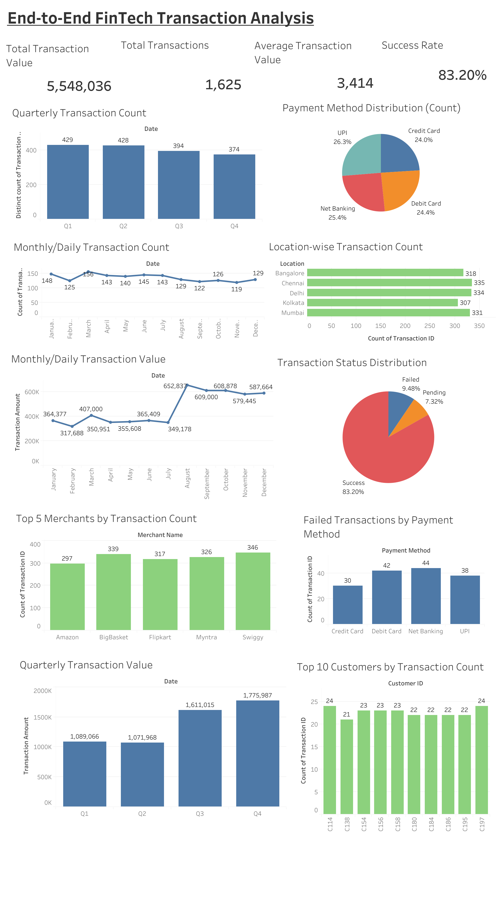

# End-to-End FinTech Transaction Analysis
## Objective of the Project:
The primary objective of this project is to analyze a transaction dataset from an emerging FinTech Company using Python-based data analysis tools and create a visually interactive Tableau dashboard for the stakeholders. The analysis aimed to:
 - Understand transaction patterns and trends over time (daily, monthly, and quarterly).
 - Evaluate the performance of different payment methods.
 - Examine location-wise activity in terms of both transaction count and value.
 - Study the distribution of transaction statuses (success, failed, pending).
 - Identify the top merchants and customers contributing to transaction activity.
 - Export findings in structured formats (Excel reports, PDF of visualizations) like:
  - - Create bar graphs, line plots, and pie charts to visually represent trends and comparisons.
  - - Export all graphs into a single consolidated PDF report using Matplotlib’s PdfPages.
  - - Compile all tabular data into an Excel report with multiple sheets and formatted tables using openpyxl for readability.
  - - Export all graphs into PNG images, all tables into CSV files.
 - Create a visually interactive Tabelau dashboard for the stakeholders.

## Dashboard Preview-

 - For full dashboard experience, click the link.
🔗 **Tableau Dashboard:** [Open Dashboard](https://public.tableau.com/views/End-to-EndFinTechTransactionAnalysisDashboard/End-to-EndFinTechTransactionAnalysis)
## Technology used:
### 1. Python: 
Python was the primary programming language used in this project. Its simple syntax and extensive libraries made it suitable for data analysis, visualization, and report generation.

**Features:**
 - Easy and readable syntax
 - Large library support
 - Efficient data analysis and visualization
### 2. Pandas:
Pandas was used for data manipulation and analysis of the transaction dataset.

**Features:**
 - Importing CSV files
 - Data cleaning and preprocessing
 - Grouping and aggregating data
 - Calculating KPIs
 - Exporting results to CSV and Excel files
### 3. Matplotlib:
Matplotlib was used to create visualizations such as:
 - Bar charts
 - Line graphs
 - Pie charts
 - Trend analysis graphs
   
It was also used to save graphs as images and generate PDF reports.
### 4. PdfPages (Matplotlib Backend):
PdfPages, available in Matplotlib, was used to combine multiple graphs into a single PDF file. This allowed all charts and visualizations to be stored and shared in one professional report.

**Features:**
 - Combines multiple graphs into one PDF.
 - Simplifies sharing of results.
 - Provides a professional reporting format.
### 5. openpyxl:
openpyxl was used to create formatted Excel reports containing multiple analysis tables.

**Features:**
 - Writing multiple tables into one Excel file.
 - Adding titles and spacing between tables.
 - Applying formatting such as fonts, colors, and column widths.

### 6. Google Colab:
Google Colab was used as the development environment for the project. It allowed the execution of Python code in the browser without local installation.

**Features:**
 - Cloud-based environment.
 - Access to pre-installed libraries.
 - Easy integration with Google Drive.
 - Simple sharing and collaboration.

### 7. Tableau:
**Tableau** is a powerful business intelligence and data visualization tool used to transform raw data into interactive dashboards and meaningful visualizations. It helps analyze trends, compare performance, and uncover insights through charts, graphs, filters, and KPI dashboards, enabling data-driven decision-making.

## Dataset Description:
The dataset used in this project contained transaction records with the following key fields:
 - **Transaction ID:** Unique identifier for each transaction.
 - **Date:** The date on which the transaction occurred.
 - **Transaction Amount:** Value of the transaction in INR.
 - **Customer ID:** Identifier for the customer making the transaction.
 - **Merchant:** Identifier for the merchant processing the transaction.
 - **Payment Method:** Mode of payment (e.g., UPI, Card, Wallet, Net Banking).
 - **Location:** The geographical location where the transaction took place.
 - **Transaction Status:** Outcome of the transaction (Success, Failed, Pending).

## Approach/Steps:
### 1. Data Import and Cleaning: 
 - Imported the transaction dataset from a CSV file.
 - Converted the Date column into proper datetime format for accurate time-based analysis.
 - Checked and removed duplicate entries to ensure data consistency.
 - Handled missing or invalid values to maintain data integrity.

### 2. Key Performance Indicators (KPIs):
 - **Total Transactions:** Count of all transactions processed.
 - **Total Transaction Value:** Sum of transaction amounts across the dataset.
 - **Average Transaction Value:** Mean value of transactions, highlighting customer spending behavior.
 - **Success Rate:** Percentage of successful transactions out of total transactions.
 - These KPIs provided a bird’s-eye view of the company’s digital transaction performance.

### 3. Trend Analysis:
 - **Daily Analysis:** Count of transactions per day revealed fluctuations, with peaks on weekends and festive periods.
 - **Monthly Analysis:** Identified steady growth in transaction volumes, with certain months contributing significantly higher transaction values.
 - **Quarterly Analysis:** Showed clear upward trends.

### 4. Categorical Analysis:
 - **Payment Method Usage:** It showed us the most popular methods for transactions. The result suggested that the consumers and Indian public is using more and more digital payment methods such as UPI etc.
 - **Location-Wise Insights:** Urban regions contributed higher transaction values, while rural areas showed more transaction counts but smaller average values — a reflection of the company's inclusive outreach.
 - **Transaction Status:** Most transactions were successful, while a small portion of failed and pending transactions highlighted opportunities for technical improvement.

### 5. Entity-Based Insights:
 - **Top Merchants:** The top 5 merchants processed the largest number of transactions, contributing significantly to the platform’s success.
 - **Top Customers:** The top 10 customers were identified as repeat users with high-frequency transactions, indicating customer loyalty.

### 6. Visualization and Reporting:
 - Created bar graphs, line plots, and pie charts to visually represent trends and comparisons.
 - Exported all graphs into a single consolidated PDF report using Matplotlib’s PdfPages.
 - Compiled all tabular data into an Excel report with multiple sheets and formatted tables using openpyxl for readability.
 - Exported all graphs into PNG images, all tables into CSV files.

### 8. Tableau Dashboard:
 - An interactive Tableau dashboard was developed to visualize key transaction insights, including KPIs, transaction trends, payment method distribution, location-wise analysis, merchant performance, and transaction status. The dashboard enables dynamic exploration of the dataset through clear and intuitive visualizations, supporting efficient business decision-making.
   
## Key Findings:
### 1. Overall KPIs:
 - The dataset showed a steady growth in transaction volumes over the observed period.
 - The success rate of transactions was high, indicating reliability of the payment system.
 - The average transaction value remained within a consistent range, reflecting stable customer spending behavior.

### 2. Transaction Trends:
 - Daily trends revealed fluctuations in transaction counts, often peaking during weekends and festive seasons.
 - Monthly and quarterly analysis showed upward growth (though transaction count decreased a bit but total transaction values increased.
 - The increasing trend suggests growing adoption of the company's services among customers and merchants.
 - High valued transactions were also found out.

### 3. Payment Method Usage:
 - It showed us the most popular methods for transactions. UPI emerged to be the most popular payment method.
 - The result suggested that the consumers and Indian public is using more and more digital payment methods such as UPI etc.
 - The increasing trend suggests growing adoption of the company's services among customers and merchants.
 - High valued transactions were also found out.

### 4. Location-wise Analysis:
 - Locations with most transactions were Chennai and Delhi.
 
### 5. Transaction Status:
 - A majority (83.20%) of the transactions were marked Successful.
 - A small proportion of Failed and Pending transactions highlighted potential areas for technical improvement.

### 6. Merchant and Customer Insights:
 - The top 5 merchants accounted for a major share of overall transactions, indicating strong partnerships.
 - The top 10 customers were identified as frequent, high-value users—signifying loyal customer segments.

### 7. Reports and Visualizations:
 - An Excel workbook was generated with detailed tables for each analysis (daily, monthly, quarterly, location-wise, status-wise).
 - A consolidated PDF report was generated containing all graphs (bar charts, pie charts, and line graphs) for ease of presentation.
 - Also, individual png images of the graphs, pie charts etc. separately generated. And the each table corresponding to graphs, pie charts etc is also generated as a csv file.

### 8. Tableau Dashboard:
 - Developed an interactive Tableau dashboard to visualize KPIs, transaction trends, payment method distribution, location-wise performance, merchant insights, customer activity, and transaction status.
 - The dashboard enables users to filter, explore, and analyze transaction data interactively for better business decision-making.
 - 🔗 **Tableau Dashboard:** [Open Dashboard](https://public.tableau.com/views/End-to-EndFinTechTransactionAnalysisDashboard/End-to-EndFinTechTransactionAnalysis)

